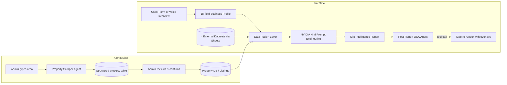
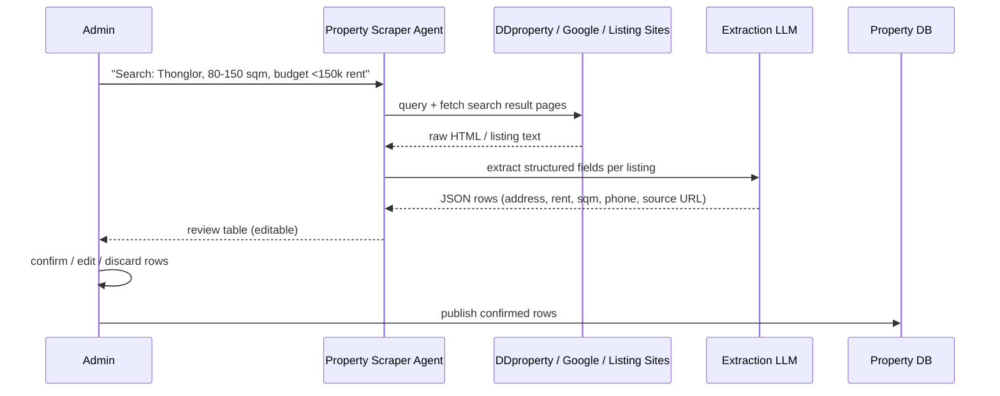
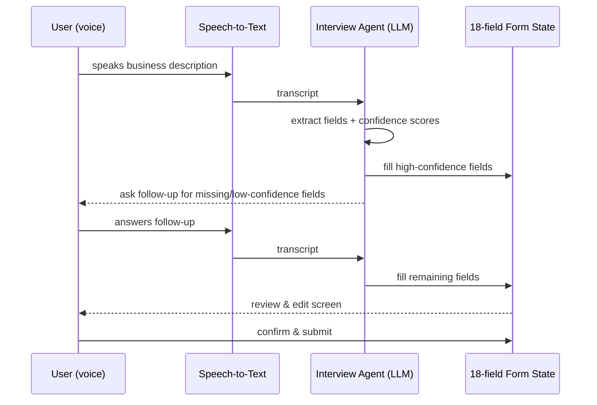
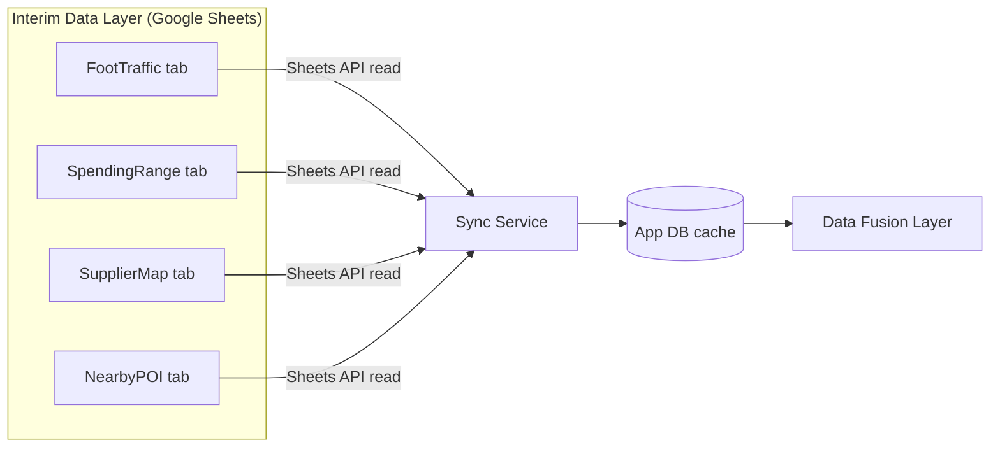
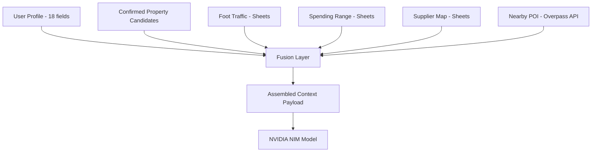
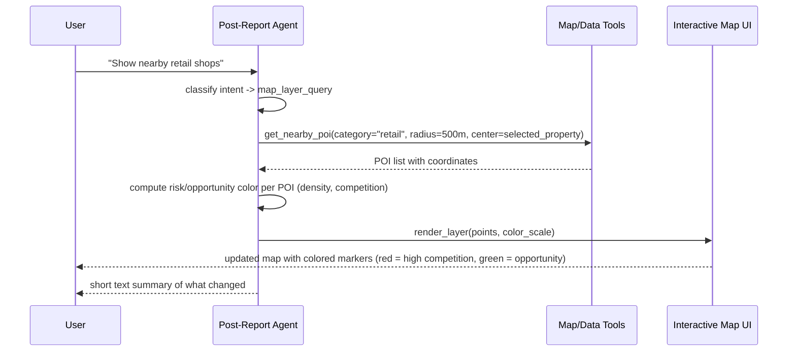
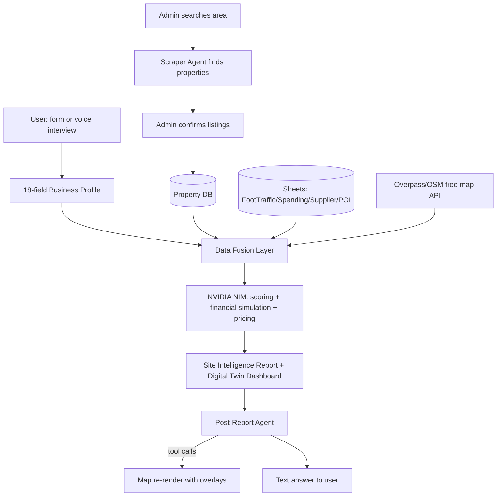

# ProvenueAI — Implementation Plan

**Project:** True Alpha Internship — Team 6PACKS
**Product:** ProvenueAI — AI-powered site intelligence & financial simulation for Thai SME restaurants

This document describes the technical implementation of the two-sided platform: the **Admin** side (automated property sourcing) and the **User** side (business intake → AI-generated Site Intelligence Report → interactive follow-up agent).

---

## 1. System Overview

ProvenueAI has two actors:

| Actor | Goal |
|---|---|
| **Admin** | Populate the property inventory without manually browsing listing sites — search by area, let an AI agent scrape + structure candidate properties, review, and publish. |
| **User (restaurant owner)** | Describe their business (18 data points) via form or voice interview → get an AI-generated location + financial feasibility report → ask follow-up questions that update the map live. |



---

## 2. Admin Side: Automated Property Sourcing

### 2.1 Problem being solved
Today, admins manually browse property sites (e.g. DDproperty, Google search, local listing sites) to find vacant units, note down location + rent + owner contact, and list them. This is slow and error-prone.

### 2.2 New flow
1. Admin enters a **target area / district** (e.g. "Sukhumvit 24, Bangkok") and optional filters (size range, budget range).
2. A **Property Scraper Agent** searches listing sources (DDproperty, Google Maps listings, Facebook Marketplace groups if accessible, other public property sites) for matching results.
3. The agent extracts structured fields per listing (see schema below) using a scrape → parse → LLM-extraction pipeline (raw HTML/text → structured JSON).
4. Results are shown to the admin as a **review table** (not auto-published) — admin can edit, discard, or confirm each row.
5. Confirmed rows are written to the **Property DB**, which becomes searchable/matchable inventory for the Site Intelligence engine.



### 2.3 Property record schema

| Field | Type | Source |
|---|---|---|
| `property_id` | UUID | generated |
| `property_name` | string | scraped |
| `address` | string | scraped |
| `district / zone` | string | scraped or geocoded |
| `lat, lng` | float | geocoded (free map API) |
| `monthly_rent_thb` | number | scraped |
| `size_sqm` | number | scraped |
| `property_type` | enum (shophouse, mall unit, standalone, food court, office retail) | scraped/inferred |
| `owner_contact` | phone/string | scraped |
| `source_url` | string | scraped |
| `listing_photos[]` | string[] | scraped |
| `scrape_confidence` | 0–1 float | extraction LLM |
| `status` | enum (pending_review, confirmed, rejected, listed) | admin action |
| `admin_notes` | string | admin |

> **Compliance note:** Only scrape publicly accessible listing pages; respect `robots.txt` and each source's terms of service; store the source URL for traceability; do not scrape login-gated or private-group content.

### 2.4 Why this matters for the model
Confirmed properties become part of the **candidate location pool** that the Site Intelligence engine scores against a user's business profile (Stage 1 scoring — see slide "Scoring Dimensions").

---

## 3. User Side: Business Intake (18 Data Points)

### 3.1 The 18 fields
Mapped from the intake UI (Business Foundation → Financial & Operational Scope → Supporting Documents → Business Profile → Target Market → Business Goals → Location):

| # | Field | Section | Input type |
|---|---|---|---|
| 1 | Project Name * | Business Foundation | text |
| 2 | Business Category * | Business Foundation | select |
| 3 | Executive Summary | Business Foundation | textarea |
| 4 | Total Investment (THB) | Financial & Operational Scope | number |
| 5 | Target Monthly Rent (THB) | Financial & Operational Scope | number |
| 6 | Required Space (sqm) | Financial & Operational Scope | range |
| 7 | Supporting Documents | Supporting Documents | file upload (parsed by AI) |
| 8 | Business Type | Business Profile | select |
| 9 | Concept Description | Business Profile | textarea |
| 10 | Operating Model | Business Profile | select |
| 11 | Customer Segments | Target Market | multi-select tags |
| 12 | Target Income Bracket | Target Market | select |
| 13 | Primary Objective | Business Goals | select |
| 14 | Expected ROI Target | Business Goals | slider |
| 15 | Operating Days | Business Operations | multi-select (Mon–Sun) |
| 16 | Average Order Value | Business Operations | number |
| 17 | Est. Setup Cost | Business Operations | number |
| 18 | Location * | Location | map click / search |

`*` required to proceed.

### 3.2 Two intake paths

**Path A — Manual form.** User fills the multi-step form directly (as shown in the wireframes).

**Path B — AI voice interview (auto-fill).** User speaks naturally; the system:
1. Captures audio → **Speech-to-Text (STT)**.
2. Passes the transcript to an **Interview/Extraction Agent** that asks clarifying follow-up questions (conversationally) until all 18 fields are confidently filled.
3. Each answer is mapped to its target field with a confidence score; low-confidence fields trigger a follow-up question instead of guessing.
4. The structured form is shown to the user for final confirmation/edit before submission — the AI never submits without user confirmation.



### 3.3 Extraction prompt shape (used by the Interview Agent)
See `AGENTS.md` → **Agent 2: Voice Interview Agent** for the exact prompt template and JSON output schema.

---

## 4. External Data Integration

### 4.1 The 4 required datasets

| Dataset | Purpose |
|---|---|
| **True Foot-Traffic Data** | Pedestrian density by hour/day, weekday vs weekend patterns |
| **Customer Spending Range** | Avg income, spending power by zone (from True + Property Info) |
| **Supplier Map** | Nearby suppliers relevant to the restaurant concept |
| **Nearby Locations** | BTS/MRT, competitors, restaurants, anchor facilities |

### 4.2 Current interim approach: Google Sheets as the data layer

Since these 4 datasets cannot yet be deployed as live map layers or dedicated APIs, the interim architecture treats **Google Sheets as a lightweight structured database**:

- Each dataset lives in its own tab (`FootTraffic`, `SpendingRange`, `SupplierMap`, `NearbyPOI`), keyed by **zone/district ID** or **lat/lng grid cell**.
- The backend reads via the **Google Sheets API** (read-only service account) on a scheduled sync (e.g. every few hours) or on-demand at report-generation time.
- This keeps the data human-editable (True's data team / partners can update the sheet directly) while giving the app a queryable interface.



**Roadmap:** replace each Sheets tab with a real API endpoint (True's internal mobility API, a financial data provider, a supplier partner API, and a POI API) without changing the Fusion Layer's interface — the Sheets sync and the future API client should implement the same internal contract (e.g. `getFootTraffic(zoneId)`).

### 4.3 Map & geocoding: avoiding Google Maps pricing

Because Google Maps Platform is metered/paid at scale, the recommended **free-tier stack** is:

| Need | Free option |
|---|---|
| Base map tiles | **OpenStreetMap** via **Leaflet.js** (or MapLibre GL for 3D/vector styling) |
| Geocoding (address → lat/lng) | **Nominatim** (OSM) or **OpenCage** free tier |
| Nearby POIs (competitors, BTS/MRT, schools, offices) | **Overpass API** (OSM POI query) |
| Static tiles at scale (optional, generous free tier) | **MapTiler** or **Stadia Maps** free plan |

Google Maps/Places is only used as a **fallback enrichment source** (e.g. review ratings, which OSM doesn't have) and should be called sparingly and cached, not per-request.

### 4.4 Data fusion for report generation



---

## 5. AI Report Generation (NVIDIA NIM)

### 5.1 Approach
The **Assembled Context Payload** (user profile + property candidate + 4 datasets) is injected into a structured prompt sent to an **NVIDIA NIM**-hosted LLM endpoint. The model performs:

1. **Site Intelligence scoring** — weighted dimensions (Foot Traffic Density 25%, Customer Profile Match 20%, Competition Landscape 20%, Accessibility & Visibility 15%, Anchor Attractions 12%, Rental Economics 8%) → GREEN / YELLOW / RED classification.
2. **Financial Simulation** — revenue-from-covers model, cost-line breakdown, break-even, payback period, scenario bands (base / +20% / −30%).
3. **Menu & Pricing recommendation** — cost floor + market ceiling pricing, BCG-style menu classification (Star/Plowhorse/Puzzle/Dog).

### 5.2 Example prompt template

```
SYSTEM:
You are ProvenueAI's Site Intelligence & Financial Simulation engine.
Use ONLY the data provided in CONTEXT. Never invent numbers.
Return output strictly as the JSON schema specified below.

CONTEXT:
- user_profile: {{18-field JSON}}
- candidate_properties: {{array of property records}}
- foot_traffic: {{zone-level hourly data}}
- spending_range: {{zone-level income/spend data}}
- supplier_map: {{nearby suppliers}}
- nearby_poi: {{competitors, BTS/MRT, anchors}}

TASK:
1. Score each candidate property on the 6 weighted dimensions.
2. Classify GREEN (75-100) / YELLOW (50-74) / RED (0-49).
3. Run the financial forecaster (revenue, COGS, labor, rent, utilities,
   marketing, misc -> net profit -> break-even -> payback period).
4. Recommend a feasible menu price range and flag any Dog-quadrant items
   if a menu/product list was provided.

OUTPUT SCHEMA: (JSON — site_scores[], financial_forecast, pricing_recommendation)
```

### 5.3 Output consumed by the frontend
The JSON output feeds the **Digital Twin / Site Intelligence dashboard** (map pins, score badges, P&L table, break-even chart) shown in the wireframes.

---

## 6. Post-Report Conversational Agent

After the report is generated, users can ask follow-up questions in natural language, e.g.:

> "I want to see nearby retail shops"

### 6.1 Behavior
This is handled by a **tool-calling agent**, not a plain chatbot — it must be able to *change the map*, not just answer in text.



### 6.2 Design notes
- The agent maintains **map state** (current center, radius, active filters) as conversation context.
- Each supported query type (retail shops, competitors, transit, suppliers, demographics) maps to a specific tool/function so outputs are deterministic and grounded in real data — the LLM chooses *which* tool and *what parameters*, not the underlying numbers.
- Color logic (red/yellow/green) reuses the same scoring weights as the Stage 1 Site Intelligence scorer for consistency.

Full tool/function specs are in `AGENTS.md` → **Agent 4: Post-Report Insight Agent**.

---

## 7. End-to-End Flow (combined)



---

## 8. Tech Stack Summary

| Layer | Choice |
|---|---|
| Frontend | React + Leaflet/MapLibre for map, Tailwind for UI |
| Backend | Node.js/Python API layer |
| Property scraping | Headless browser / HTTP fetch + LLM extraction step |
| STT | Any streaming STT provider (e.g. Whisper-based) |
| Interview/Extraction Agent | LLM w/ structured JSON output + confidence scoring |
| Report generation | NVIDIA NIM-hosted LLM endpoint |
| Interim data store | Google Sheets API (read-only service account) |
| Geocoding & POI | Nominatim + Overpass API (OSM, free) |
| Property DB | Relational DB (e.g. Postgres) |
| Post-report agent | LLM with function/tool calling bound to map + data query tools |

## 9. Roadmap

1. **MVP**: manual form intake, Sheets-backed data, OSM map, single NIM report call.
2. **V2**: add voice interview auto-fill, admin scraper agent, post-report Q&A tool-calling.
3. **V3**: replace Sheets with dedicated APIs (True mobility API, supplier partner API), add True POS one-click onboarding.
